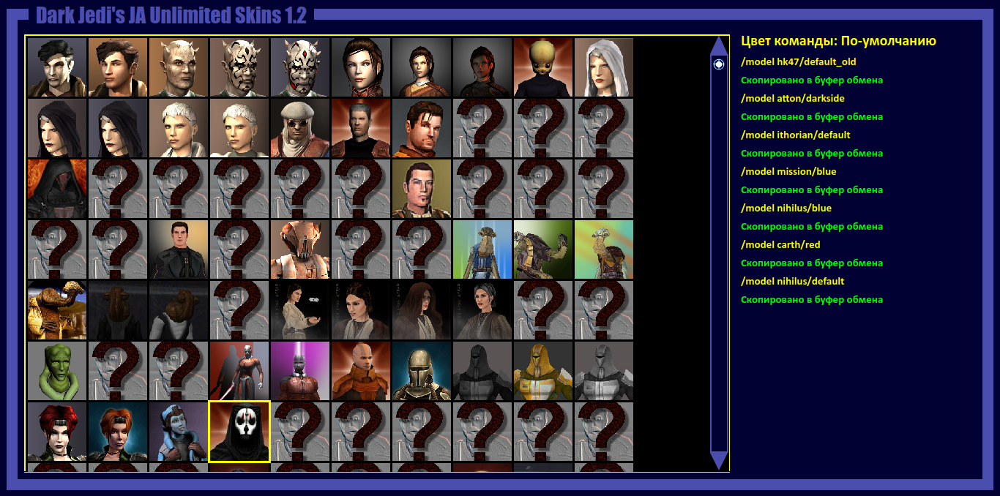

# JA Unlimited

JA Unlimited is a utility for the Jedi Knight: Jedi Academy game's multiplayer mode.

In this game amount of visible for selection player models (skins) is limited so when there is many additional skins a lot of them is not visible.

A model name and icon can be gotten from pk3 files that are simple zip archives. But browsing and finding the models in the archives is too long and complicated.

This utility solves the problem and loads all skins from the game folder comfortable displaying their icons and saving console comands to apply them in the game.

Skins can be applied by entering command into the game's console. The comand is like:  
`/model model_name/default`

There is a default, blue and red teams to select.

## Getting Started

### Prerequisties

You will need to build:

* Qt

### Installation

To install the program put the folder within an executable file into the **base** folder of the game.

### Using

When you select a skin its command is automatically copied to the clipboard. Then you will need paste (`Ctrl` + `V`) the copied command into the game's console (to show the console press `Shift` + `~` aka `Shift` + `Ё`).

## License

This project is licensed under the MIT License - see the [LICENSE](LICENSE) file for details.  
Copyright (c) 2016 Jed Dark